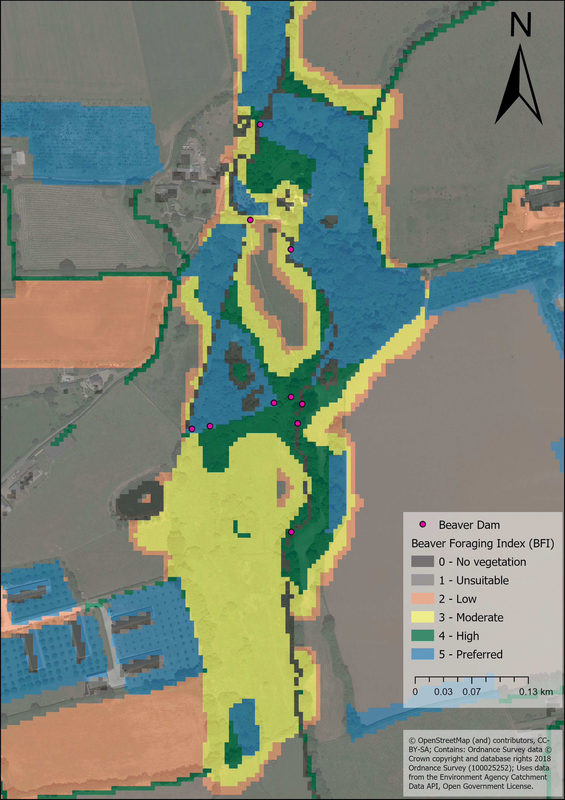
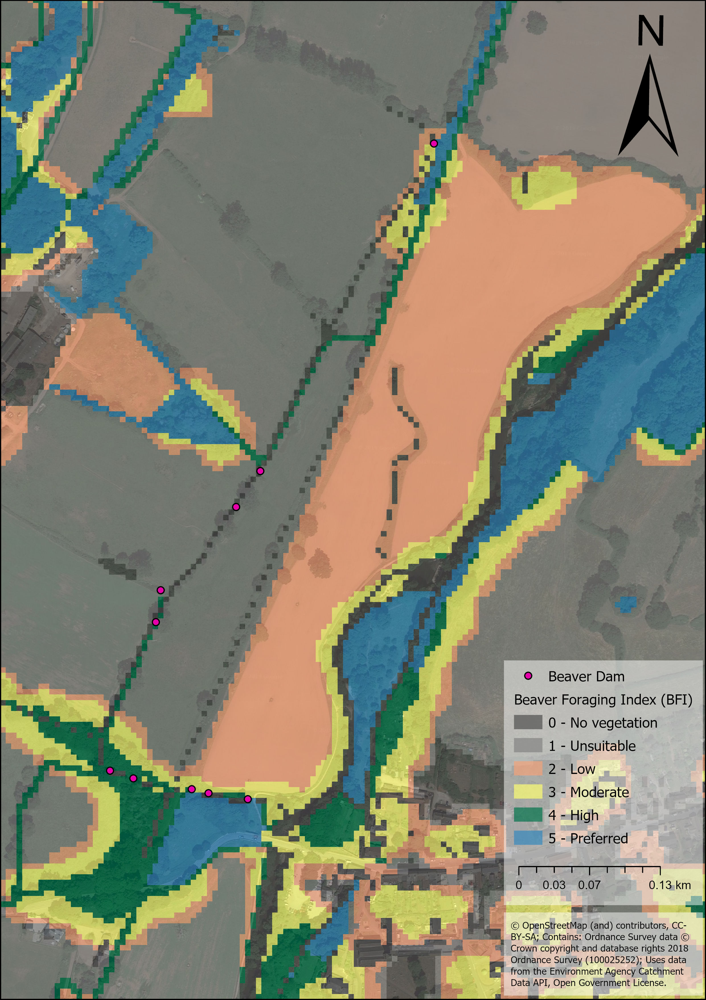
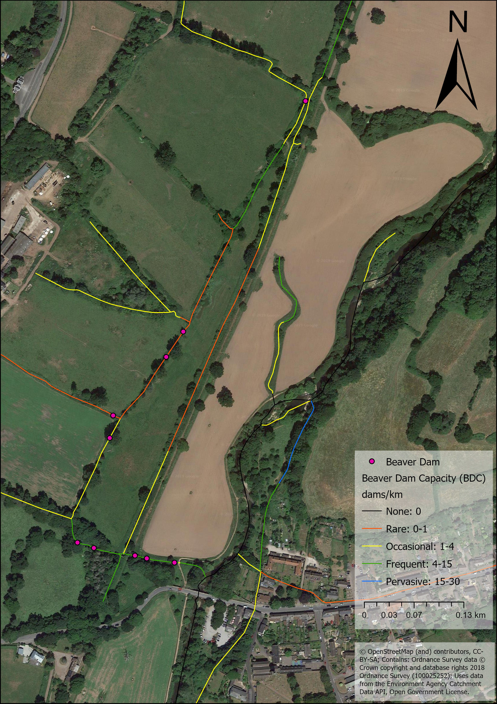
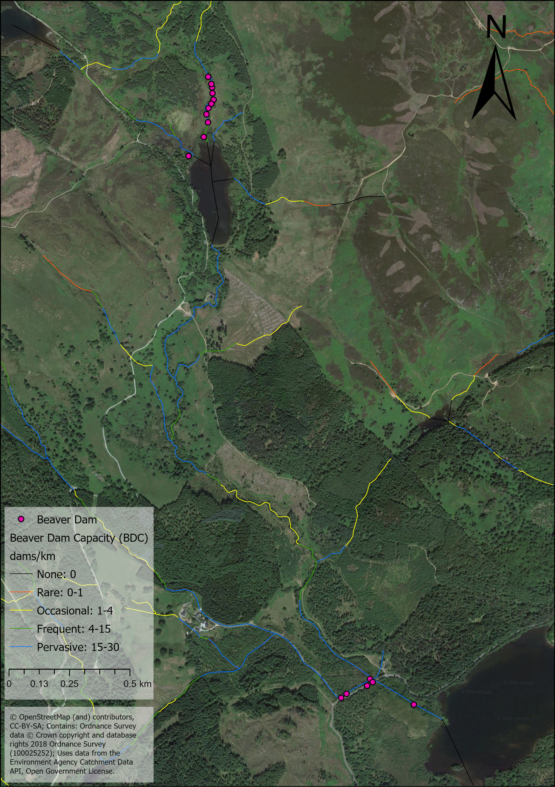
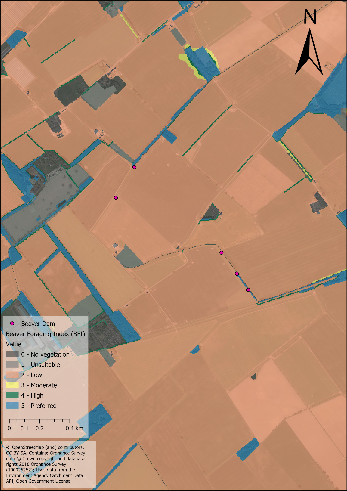
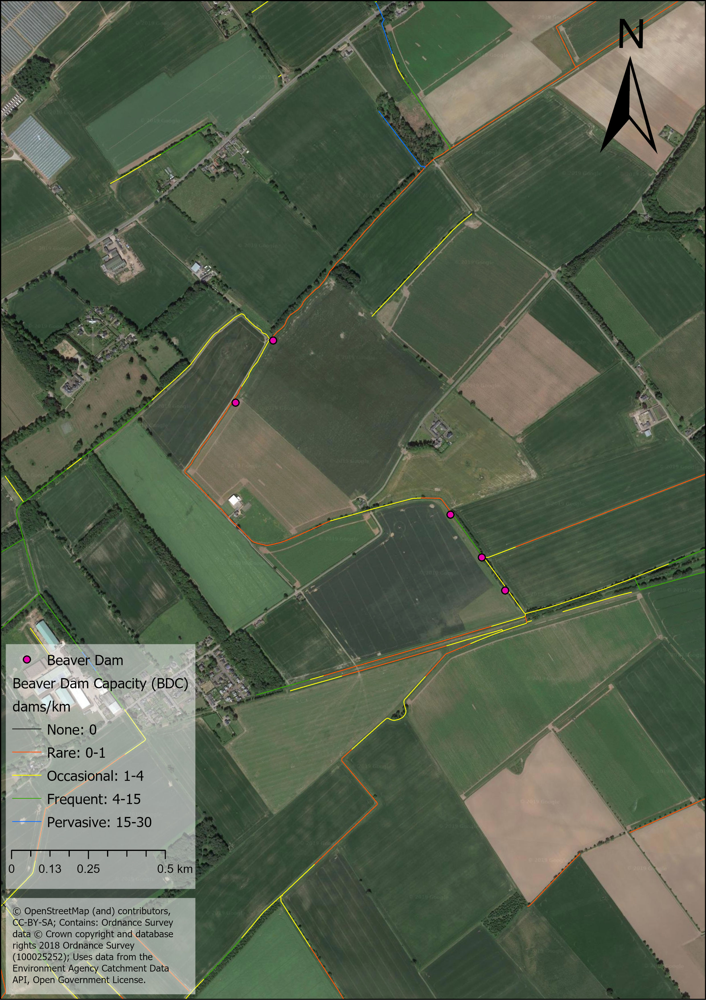
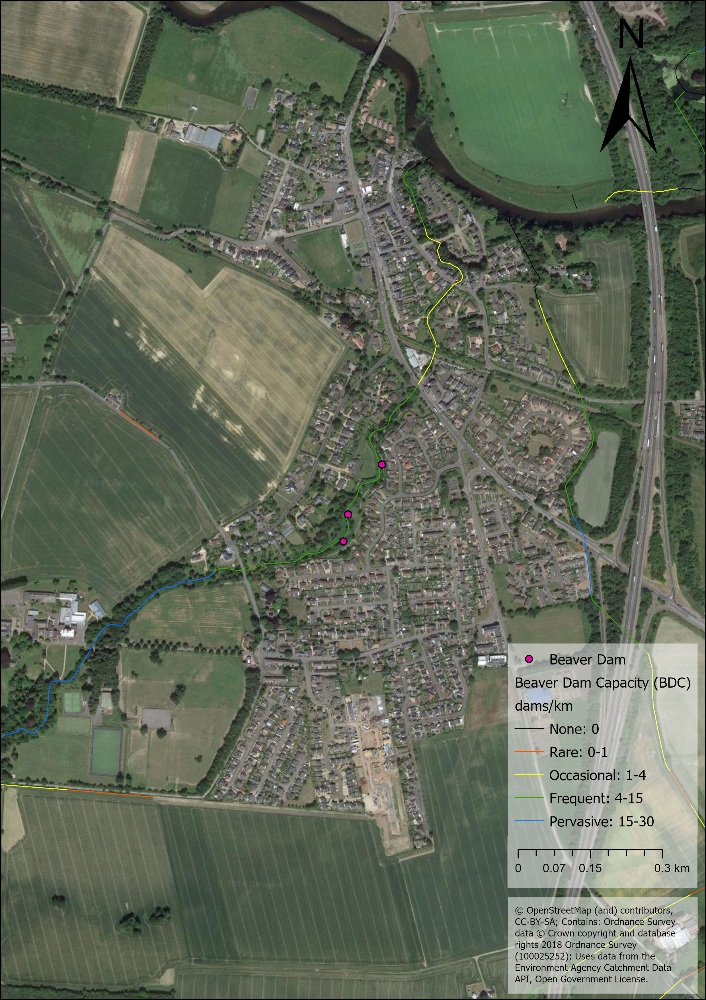
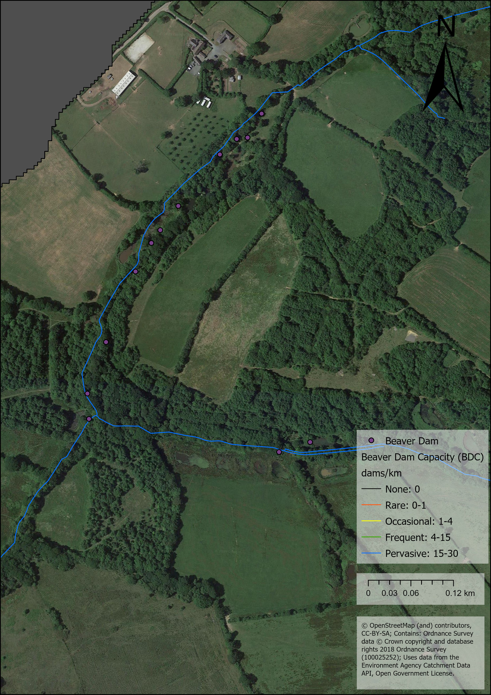

## Add a bunch of maps to give examples of BDC results at local scale
*locations of these sites are not provided to maintain land-owner privacy*

 

### River Otter Catchment Examples

#### Low intesity Agricultral Landscape.

This is the site of a beaver release in 2016. The animals have since remained in this reach and have also reproduced. The site 
composes a semi-natural grassland site with riparian woodland and encroaching willow shrub. The surrounding land is largely dominated 
by mixed grazing and arable farmland. The maximum number of dams constructed at this site, at any one time, is 10 by approximately 4 
animals. These dams frequently incur damage during high flows being either partially or fully “blown-out”. Often, following their 
destruction, the dams are then reconstructed during periods of low flow.

 

*All dams within this area have been constructed along reaches classified as pervasive or frequent. This example illustrates 
that the model effectively discriminates between those more densely wooded areas to the north of the site which offer more building 
and foraging materials than the southern part of the site where vegetation is confined to a narrower riparian strip. The Beaver at 
This site have clearly expressed a preference to dam construction around their dwelling, located in the more heavily wooded north
of the site.*

 
 

#### Intensively-managed grassland landcape

Beaver were first identified at this site in 2016. Initially, the dwelling and related damming activity was located in a small isolated 
wet woodland in the centre of the site. Beaver have since established a dwelling in the mixed woodland to the south of the site

 

*As shown by the BFI map, this is an example where some discontinous woodland is not captured. This could explain why three dams 
occur in reaches classified as rare. However, all three of these dams have since been abandoned in favour of the more densely wooded
area to the south of the site. where six dams have been built.*

 
 

### River Tay Catchment Examples

#### Tay Catchment Semi-Natural/Low Intensity grazing landscape

BFI and BDC maps of two beaver dam complexes in a semi-natural setting within the Tay catchment. 
There are two dam complexes in this area, both of which are located on the inflow to lakes.

 

*Both dam complexes are positioned on reaches classified as pervasive. In this example, there are clear distinctions between reaches 
with plentiful surrounding woody vegetation and those where grassland prevails. Additionally, lakes are correctly classified as having 
no capacity for dams.*

 
 

#### Tay Catchment Arable farming setting.

BFI and BDC maps of a sequence of beaver dams in an agricultural (arable) landscape within the Tay Catchment

 

*The five dams within this sequence are located within reaches classified as rare (n=1), occasional (n=2) and frequent (n=2). 
The model effectively locates reaches with minimal streamside vegetation that is capable of supporting beaver dams and can differentiate 
between these reaches and those less favourable. It is also notable that other patches of woodland within this scene are also competently 
characterised by the model.* 

 
 

#### Tay Catchment Semi-Urban Landscape.

Map of Beaver Dam capacity model in a semi-urban setting within the Tay Catchment. A sequence of three beaver dams that have been constructed 
in a small area of woodland within a settlement.

 

*All three dams are located in reaches classed as frequent. This is good example of how beavers can often make use of localised areas of 
key habitat within a wider landscape of less suitable habitat.*

 
 

#### Coombeshead Sub-catchment

The following BFI and BDC maps show the full extent of the damming activity in the Coombeshead sub-catchment. A total of 13 dams were constructed at the
time of surveying.

 

*All reaches within the inhabited area were classified as pervasive. The BFI here highlights the efficacy of identifying areas of substantive woodland 
and in addition narrow hedgerows which also provide important forage resources for beaver in some landscapes.*

